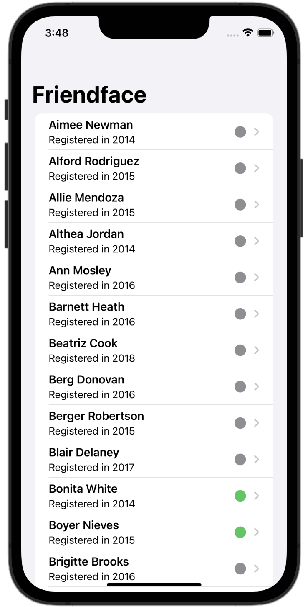
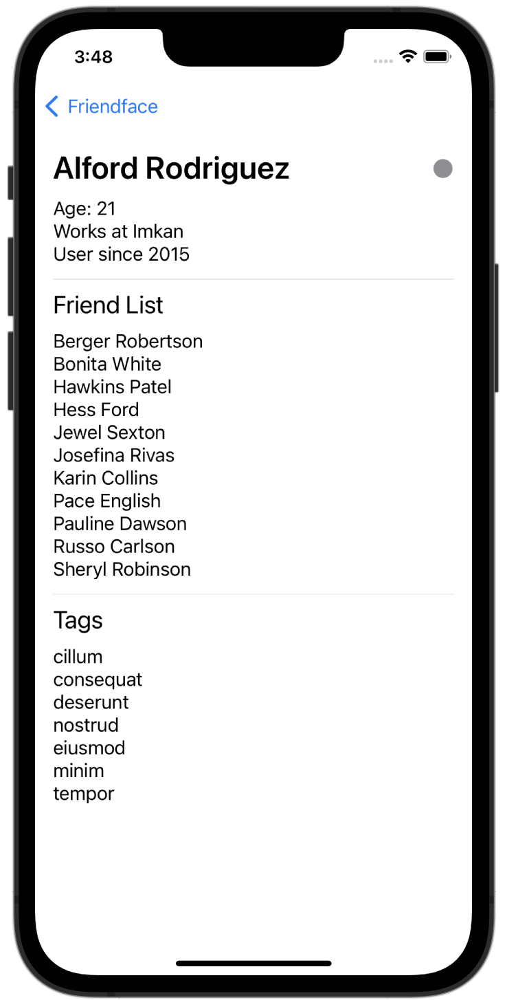

# Friendface

A simple iOS app that retrieves JSON data from the internet and displays it to the user on their iPhone.

## Installing / Getting started

To run this project, you will need a Mac computer with the latest version of Xcode and an iOS 15 Simulator set up. Simply clone the respository, open the project in Xcode, and run the app to get it working.

## Features

* Download user data as JSON from hackingwithswift.com and decode into Swift objects
* Display basic user data on main view
    * Tap on user to show detail view, with more information
* Save local, cached versions of users and their friends to Core Data for offline access and redundancy

## Credit

The idea for this project came from Paul Hudson's *100 Days of SwiftUI*. I may eventually add to this code, but credit for the base code goes to Paul Hudson. Links to each day on which material is referenced may be found below:

[Day 60 - Milestone: Projects 10-12](https://www.hackingwithswift.com/100/swiftui/60)

[Day 61 - Time for Core Data](https://www.hackingwithswift.com/100/swiftui/61)

## Screenshots

Screenshots will go here when they are ready.

    
    

